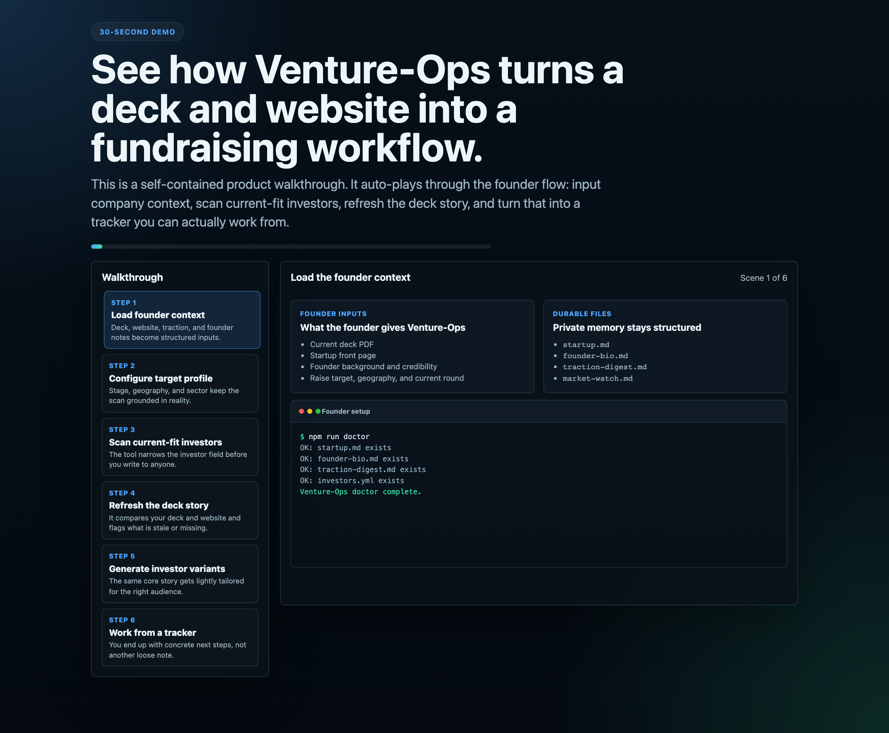
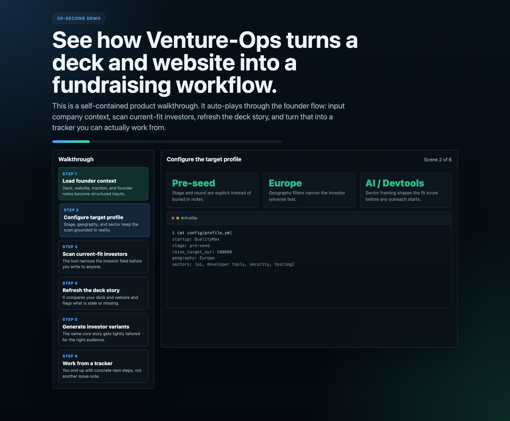
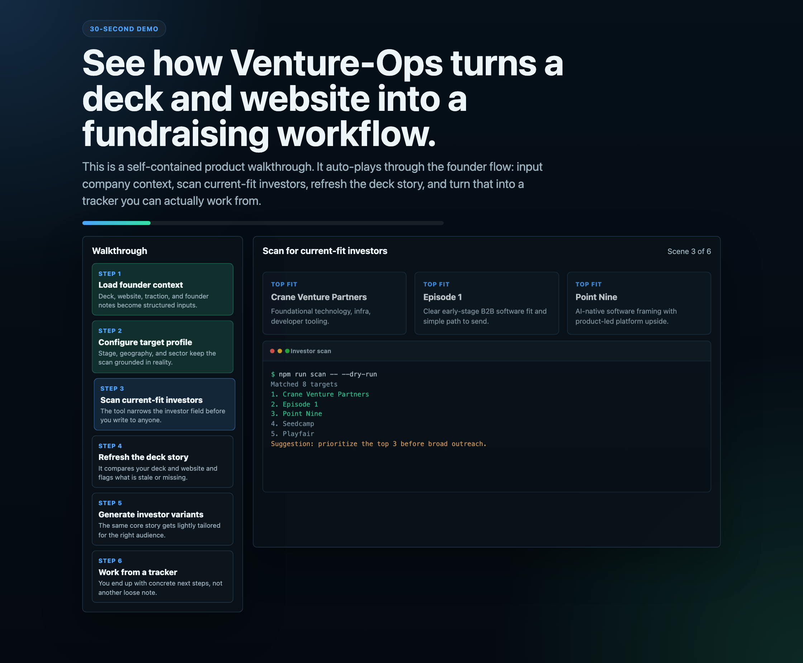
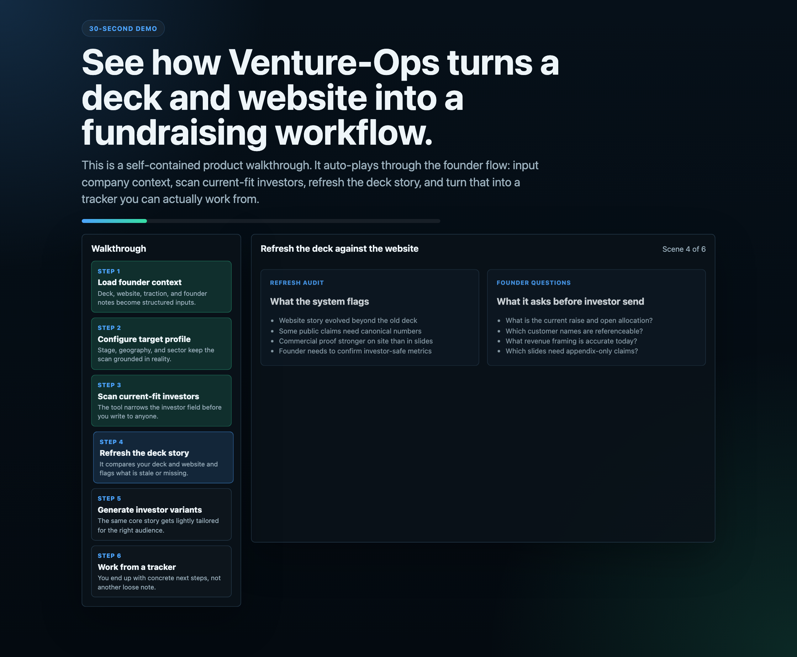
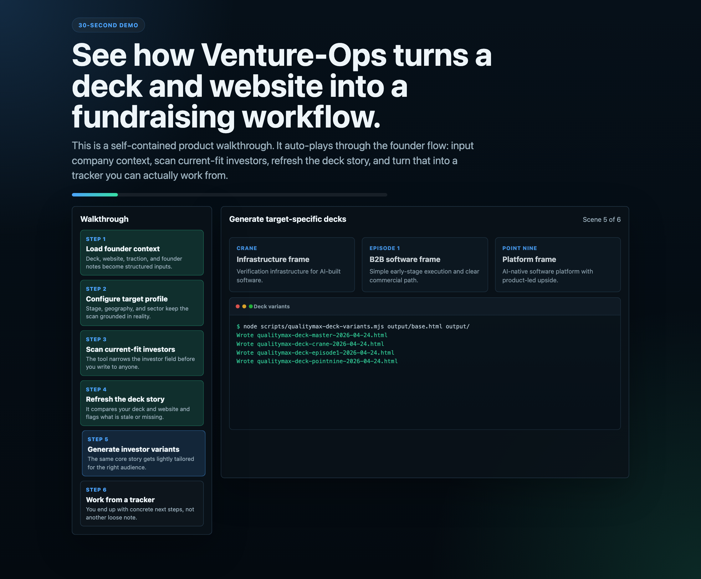
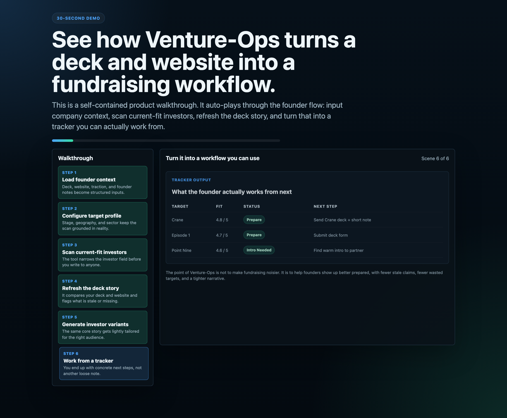

# Venture-Ops

> Claude Code 上に構築された AI 駆動のファンドレイジング運営ツール。投資家スキャン、ピッチデック更新、アクセラレーター申請、フォローアップケイデンスのためのスキルモード。バッチ処理、PDF 生成に対応。

*[santifer/career-ops](https://github.com/santifer/career-ops) にインスパイアされ、ラウンドを調達する創業者向けに適応。*

---

Venture-Ops は創業者のための AI ファンドレイジングコマンドセンターです。投資家の発見、ピッチデックの更新、申請書の下書き、パイプラインの追跡、そして市場を意識したファンドレイジング運営を一括管理できます。

古いデッキ、散在する投資家メモ、汎用的な申請書をやりくりする代わりに、以下を実現する構造化されたシステムを手に入れましょう：

- 自社に本当にフィットする投資家やプログラムを見つける
- デッキ、ウェブサイト、プロダクトが乖離したときにストーリーを刷新する
- 創業者通話やパートナーミーティング前に不足点を発見する
- より洗練されたアウトリーチ、申請書、フォローアップを準備する
- 毎週ゼロから始めるのではなく、生きたファンドレイジングの記憶を維持する

> **重要：** Venture-Ops は投資家へのスパムボットではありません。これは磨き上げシステムです。創業者がより良いターゲットを選び、ストーリーを絞り込み、より良い資料を準備するのを支援します。何を送るかを決めるのは、常に創業者自身です。

## 30 秒デモ

GitHub は README からインタラクティブな HTML を除去するため、ライブウォークスルーは独立したページに置かれています：

- [30 秒ライブデモを開く](https://desperado.github.io/venture-ops/30-sec-demo.html)

実際の創業者フローを示しています：スタートアップコンテキストの読み込み、現在フィットする投資家のスキャン、ウェブサイトに対するデッキの刷新、ターゲット固有のデッキバリアントの生成、そして散在するメモではなくトラッカーからの作業。

## 完全なデモウォークスルー

README 内でプロダクト全体を直接理解することもできます：

### 1. 創業者コンテキストの読み込み



創業者がすでに持っているファイルから始めます：デッキ、ウェブサイト、創業者の経歴、トラクションメモ、調達プロフィール。

### 2. ターゲットプロファイルの設定



Venture-Ops は、アウトリーチが始まる前に、ステージ、地域、カテゴリの枠組みを明示的なフィルターに変換します。

### 3. 現在フィットする投資家のスキャン



広いリストではなく、スキャナーが理由付きの小さなショートリストに絞り込みます。

### 4. ウェブサイトに対するデッキの刷新



刷新ループは、乖離、古い主張、および資料を送る前に答えるべき創業者の質問を表面化します。

### 5. ターゲット固有のデッキ生成



一つの共通の会社のストーリーを、デッキ全体をゼロから再構築せずに、Crane、Episode 1、Point Nine などの会社向けに軽くリフレームできます。

### 6. トラッカーからの作業



最終状態はワークフローです：誰がフィットするか、次に何を送るか、ラウンドがどこにあるか。

## 一目でわかる概要


平易な言葉で：

1. 現在のデッキ、ウェブサイト、創業者コンテキスト、目標をシステムに提供します。
2. それらのインプットを比較し、古くなっているものや不足しているものを見つけ、どの投資家がフィットするかを確認します。
3. ストーリーがまだ弱い部分で、的を絞ったフォローアップ質問をします。
4. 刷新された資料、ランク付けされたターゲットリスト、取り組むべきパイプラインを提供します。

## このツールができること

Venture-Ops は、あらゆる AI コーディング CLI を創業者側のファンドレイジングオペレーティングシステムに変換します。

以下を必要とする創業者向けに設計されています：

- プレシード、シード、または初期機関ラウンドを調達する
- アクセラレーター、創業者プログラム、スタジオ、グラントに申請する
- 毎月ゼロから書き直すことなくピッチデックを最新の状態に保つ
- どの VC が本当にフィットしていて、どれが時間の無駄かを理解する
- ターゲット固有の申請回答とイントロ文を準備する
- トラクション、証拠ポイント、リスク、投資家の反論の構造化された記憶を維持する

システムはエージェント型です：公開スタートアップサイトを検査し、現在のデッキと比較し、古くなっているものを特定し、より鋭い証拠を提案し、次の会話のためのターゲット固有の資料を準備できます。

## 何を入力するか

非技術系の創業者でも、Venture-Ops を非常に整理されたアナリストとして考えることができます。

提供するもの：

- 現在のデッキ
- ウェブサイト
- 創業者の経歴
- トラクションメモ
- ターゲットラウンドと地域
- キュレートされた投資家リスト、または始めるためのいくつかの URL

## 何が得られるか

返ってくるもの：

- デッキ刷新監査
- ランク付けされた投資家ショートリスト
- 創業者フォローアップ質問
- ターゲット固有のアウトリーチ/申請書下書き
- 誰にいつ連絡するかのトラッカー
- ストーリーを最新の状態に保つのに役立つ市場/ニュースメモリ

## サニタイズされた実際の例

以下は、実際の創業者デッキと公開会社ウェブサイトから派生したサニタイズされた例です。機密性の高い数字、顧客の詳細、内部の主張は意図的にプレースホルダーに置き換えられています。


Venture-Ops がその実際のケースで行ったこと：

- 現在のデッキを構造化されたメモに展開
- トップページと公開創業者プロフィールを確認
- デッキとウェブサイト間のナラティブの乖離を発見
- 投資家送付前にデューデリジェンスのギャップをフラグ
- 新しいデッキ下書きとターゲットショートリストを作成

## ライブ VC 検索例

これは、**2026 年 4 月 24 日**にヨーロッパのプレシード AI テスト/開発者インフラ会社向けに実施された実際のライブ検索からのビジュアルスナップショットです。


非技術系創業者にとってこれが重要な理由：

- 白紙から始めるわけではない
- ツールが理由付きの小さなショートリストに絞り込む
- 誰かに書く前に「なぜこの会社か」という角度を提供してくれる

## 公式サイトスナップショット

これらは、Venture-Ops がそのライブ検索で使用した実際の公式ウェブサイトです。

<table>
  <tr>
    <td align="center"><br><sub>Crane Venture Partners</sub></td>
    <td align="center"><br><sub>Point Nine</sub></td>
  </tr>
  <tr>
    <td align="center"><br><sub>Seedcamp</sub></td>
    <td align="center"><br><sub>Frontline Seed</sub></td>
  </tr>
  <tr>
    <td align="center"><br><sub>Playfair</sub></td>
    <td align="center"><br><sub>Episode 1</sub></td>
  </tr>
</table>

ライブソース：

- [Crane Venture Partners](https://crane.vc/)
- [Point Nine](https://www.pointnine.com/)
- [Seedcamp](https://seedcamp.com/)
- [Frontline Seed](https://frontline.vc/frontline-seed/)
- [Playfair](https://playfair.vc/)
- [Episode 1](https://www.episode1.com/)

## 創業者が実際に行うこと

非技術系の場合、ワークフローはシンプルです：

1. 現在のストーリーを `startup.md`、`founder-bio.md`、`traction-digest.md` に入力します。
2. `config/profile.yml` にターゲットラウンドと地域を追加します。
3. `investors.yml` に投資家名または URL を追加します。
4. エージェントにデッキの刷新、投資家のスキャン、またはターゲットの比較を依頼します。
5. 生成されたショートリストを確認し、フォローアップ質問に答えます。
6. 最良の申請書と紹介のみを送り、あらゆる場所に何でも送るのではなく。

## 機能

| 機能 | 実際には何を意味するか |
|---------|---------------------------|
| **ターゲットスキャナー** | ステージ、セクター、地域、ラウンドに一致する投資家、アクセラレーター、エンジェル、創業者プログラムを見つける |
| **フィット評価** | 名前を与えるだけでなく、ターゲットがフィットする理由またはしない理由を説明する |
| **デッキ刷新** | デッキ、ウェブサイト、創業者インプット、現在の証拠を比較して古い主張と不足スライドを見つける |
| **ピッチデック生成** | 10-12 スライドのナラティブを下書きし、HTML/PDF にエクスポートする |
| **創業者質問ループ** | ストーリーが不完全または矛盾しているときに最も価値の高い質問をする |
| **ニュース/トレンドメモリ** | `market-watch.md` で市場の変化、関連するインシデント、カテゴリタイミングフックを追跡する |
| **パイプライン追跡** | ターゲット、ステータス、フォローアップタイミングの単一の事実源を維持する |
| **ヒューマンインザループ** | 下書きと推奨を行い、創業者は提出のコントロールを維持する |

## 使用例

### 1. 投資家ミーティング前に古いデッキを刷新する

お持ちのもの：

- 数週間前の PDF デッキ
- 進化したスタートアップウェブサイト
- ナラティブに反映されていない製品アップデート

Venture-Ops を使用して：

- デッキをトップページと比較する
- 不足しているメトリクス、古い製品スコープ、古いスクリーンショットをフラグする
- ターゲットを絞った創業者の質問をする
- 更新された 12 スライドの下書きを生成する

### 2. 広いリストではなく本当にフィットする投資家を見つける

ベルリン拠点のプレシード創業者で、開発者インフラを構築しています。

Venture-Ops を使用して：

- ターゲットプロファイルを一度設定する
- キュレートされた投資家ユニバースをスキャンする
- フィットでターゲットをランク付けする
- 今週時間をかける価値がある人物とスキップすべき人物を特定する

### 3. 汎用的な回答なしでアクセラレーターに申請する

YC、EF、Antler、または別の創業者プログラムに申請したい。

Venture-Ops を使用して：

- 各プログラムに合わせて会社のストーリーを適応させる
- より鋭い創業者のバイオと申請回答を生成する
- デッキが「なぜ今か」を不十分に説明している箇所を強調する

### 4. ファンドレイジングナラティブを最新の状態に保つ

市場は急速に変化します。

Venture-Ops を使用して：

- 現在のトレンドと隣接する会社のニュースを監視する
- `market-watch.md` を更新する
- 次の投資家通話前に「これは今デッキで変更すべき」のシグナルを表面化する

## クイックスタート

```bash
git clone https://github.com/Desperado/venture-ops.git
cd venture-ops
npm install
npx playwright install chromium
npm run doctor
```

次にカスタマイズ：

1. `startup.md` を会社の事実源で編集します。
2. `founder-bio.md` を創業者の経歴と信頼性で編集します。
3. `traction-digest.md` をメトリクス、顧客、証拠で編集します。
4. `market-watch.md` をトレンド、競合他社の動き、タイミングフックで編集します。
5. `config/profile.yml` をステージ、地域、ラウンドサイズ、投資家ターゲティングで編集します。
6. `investors.yml` を編集して、追跡したいファンド、エンジェル、アクセラレーター、グラント、創業者プログラムを追加します。

公開ビジュアルを更新したい場合：

```bash
npm run readme:assets
```

## 使用方法

### ローカルコマンド

```bash
npm run doctor                  # initialize and verify setup
npm run scan -- --dry-run       # preview matching targets
npm run scan                    # append matches to data/pipeline.md
npm run verify                  # validate tracker/report integrity
npm run deck -- deck.html out.pdf
npm run followup                # surface follow-up candidates from tracker
```

### AI コーディングエージェント内

```text
/venture-ops                    -> show menu
/venture-ops scan               -> discover matching targets
/venture-ops evaluate {URL}     -> investor/accelerator fit report
/venture-ops deck {target}      -> tailored pitch deck package
/venture-ops refresh            -> audit deck + website + founder updates
/venture-ops news               -> trends/news monitoring and implications
/venture-ops apply {target}     -> application / outreach assistant
/venture-ops pipeline           -> process data/pipeline.md
/venture-ops tracker            -> status overview
/venture-ops followup           -> cadence and draft follow-ups
/venture-ops compare            -> rank multiple targets
/venture-ops deep               -> deep-dive one target
```

または単純に貼り付け：

- VC の URL
- アクセラレーターページ
- 現在のデッキ
- スタートアップサイト

そしてエージェントに関連モードを実行するよう依頼します。

## プロンプト例

```text
Refresh my deck from this PDF and compare it against my website.

Find the top 10 VCs in Europe for a pre-seed developer-tools company.

Evaluate whether YC or EF is the stronger fit for us right now.

Turn this existing fundraising narrative into a tighter 12-slide deck.

Read my startup front page and tell me what an investor would still find unclear.

Update market-watch.md with the last 30 days of relevant category news.
```

## 動作の仕組み

```text
Deck + website + founder memory + traction notes
                   │
                   ▼
        Refresh loop + fit scoring + trend monitoring
                   │
          ┌────────┼────────┐
          ▼        ▼        ▼
      Reports    Decks    Tracker
       .md      .pdf/.html  .md
```

重要な点：Venture-Ops は単に「デッキを書いてくれ」ではありません。再利用可能な運営モデルです：

- 事実源ファイル
- モードベースのワークフロー
- 投資家スキャナー
- 刷新ループ
- ナラティブメモリ
- トラッカー規律

## コアファイル

| ファイル | 目的 |
|------|---------|
| `startup.md` | 会社の事実源：問題、解決策、市場、トラクション、ロードマップ |
| `founder-bio.md` | 創業者のナラティブ、信頼性、創業者市場フィット |
| `traction-digest.md` | 投資家資料のためのコンパクトな証拠ポイントメモリ |
| `market-watch.md` | 現在のトレンド、ニュースフック、競合シグナル |
| `config/profile.yml` | 調達プロファイル、ラウンド、地域、セクター、理想的なターゲットタイプ |
| `investors.yml` | スキャンとフィットマッチングのためのキュレートされたターゲットユニバース |
| `data/pipeline.md` | 処理すべき保留中のターゲット |
| `data/targets.md` | ファンドレイジングトラッカー |
| `reports/*` | 生成された評価、デッキ下書き、刷新監査 |
| `output/*` | 生成されたスライド HTML と PDF |

## プロジェクト構造

```text
venture-ops/
├── startup.md
├── founder-bio.md
├── traction-digest.md
├── market-watch.md
├── config/profile.yml
├── investors.yml
├── modes/
├── templates/
├── data/
├── reports/
├── output/
└── assets/readme/
```

## 運営原則

これはフィルターであり、スパムマシンではありません。

少数の高フィット、高コンテキストの投資家会話は、広い冷たいアウトリーチを上回ります。Venture-Ops は創業者をより鋭くすべきであり、より騒がしくするためではありません。

また、時間とともに改善されるべきです：

- 創業者の修正のたびにプロファイルが研ぎ澄まされる
- 新しいメトリクスのたびにデッキが改善される
- 見逃した質問のたびに将来のチェックリスト項目になる
- 市場の変化のたびにナラティブメモリが更新される

## 免責事項

**Venture-Ops はローカルのオープンソースワークフローであり、ホスト型ファンドレイジングプラットフォームではありません。**

使用することで、以下を認めます：

1. **データはあなたが管理します。** 創業者の詳細、投資家メモ、トラクション、ファンドレイジング資料は、AI プロバイダーに送ることを選択しない限り、あなたのマシンに留まります。
2. **提出はあなたが管理します。** システムは下書きと推奨を行いますが、あなたに代わって申請書を提出したりアウトリーチを送ったりすべきではありません。
3. **現在の事実を確認します。** 投資家パートナー、締め切り、チェックサイズ、プログラム条件は頻繁に変更されます。使用前に現在の主張を確認してください。
4. **保証なし。** フィットスコアは推奨であり、真実ではありません。投資家は決定論的なシステムではありません。判断を使用してください。

## ライセンス

MIT
