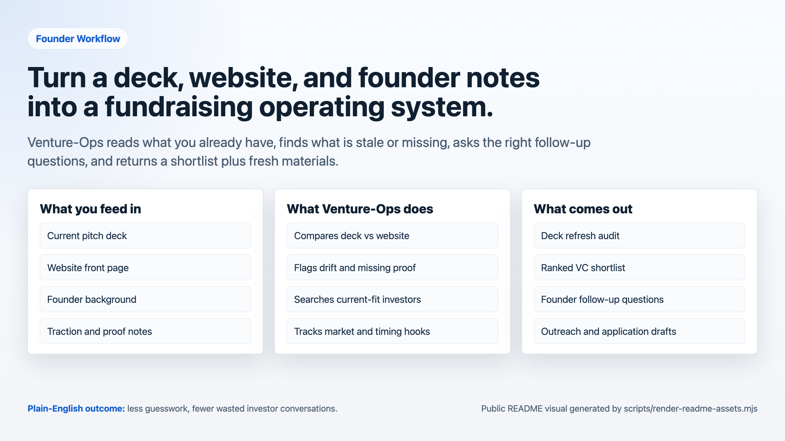
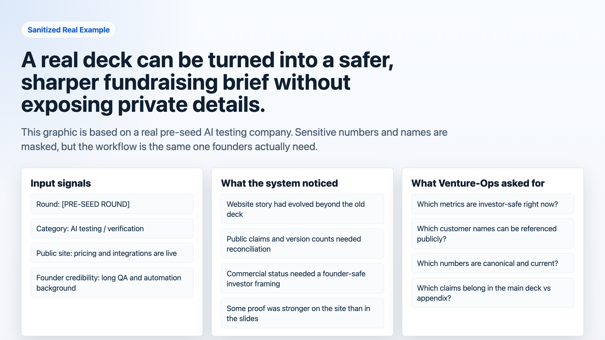
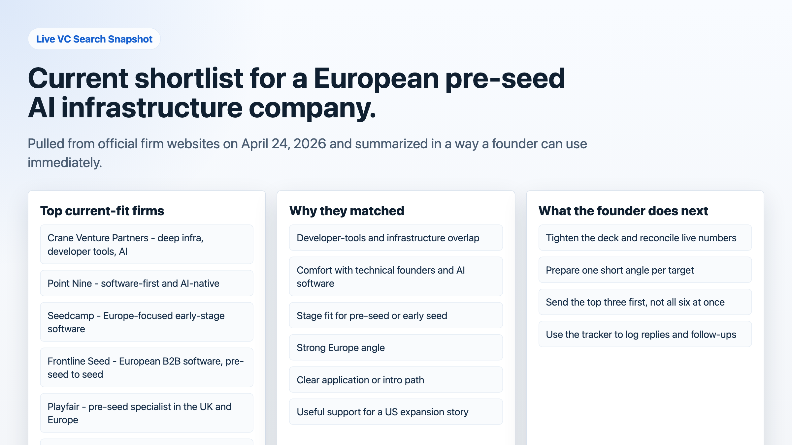
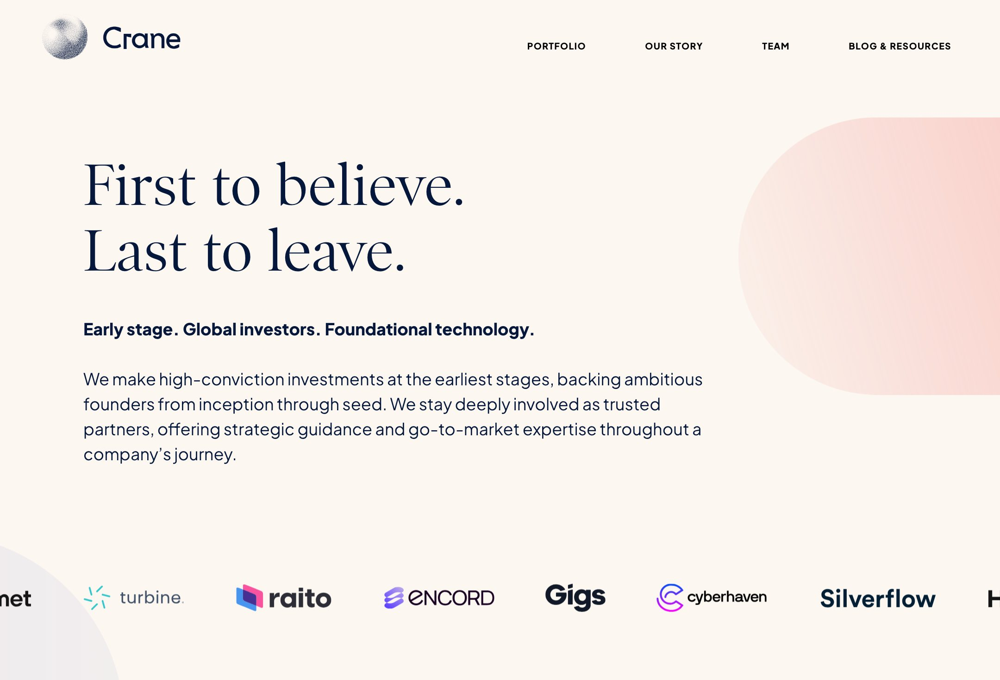
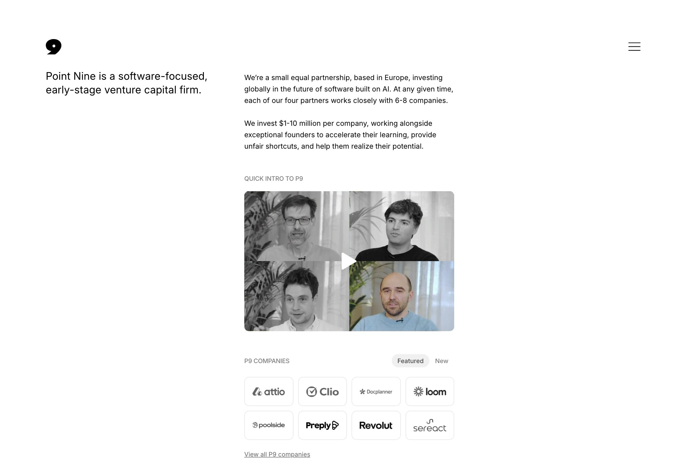
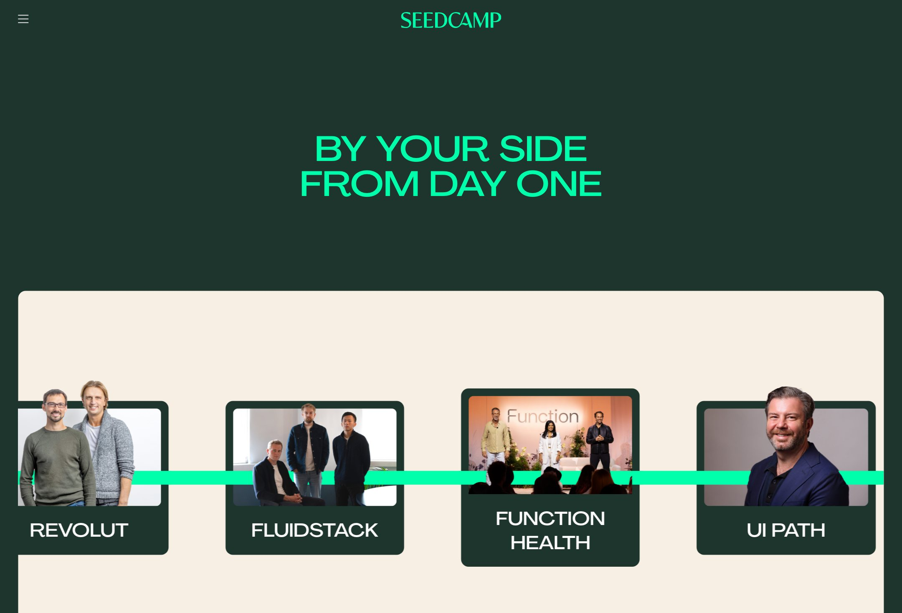
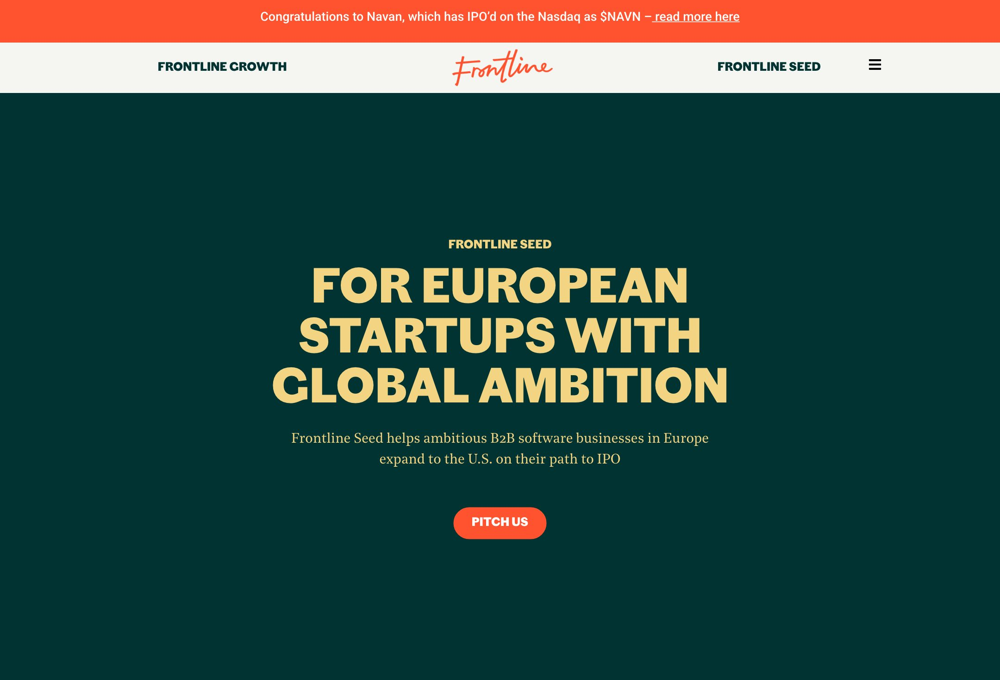
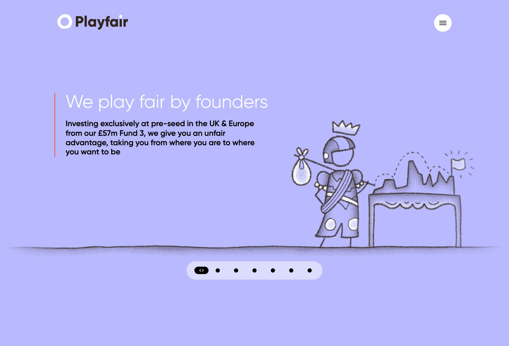
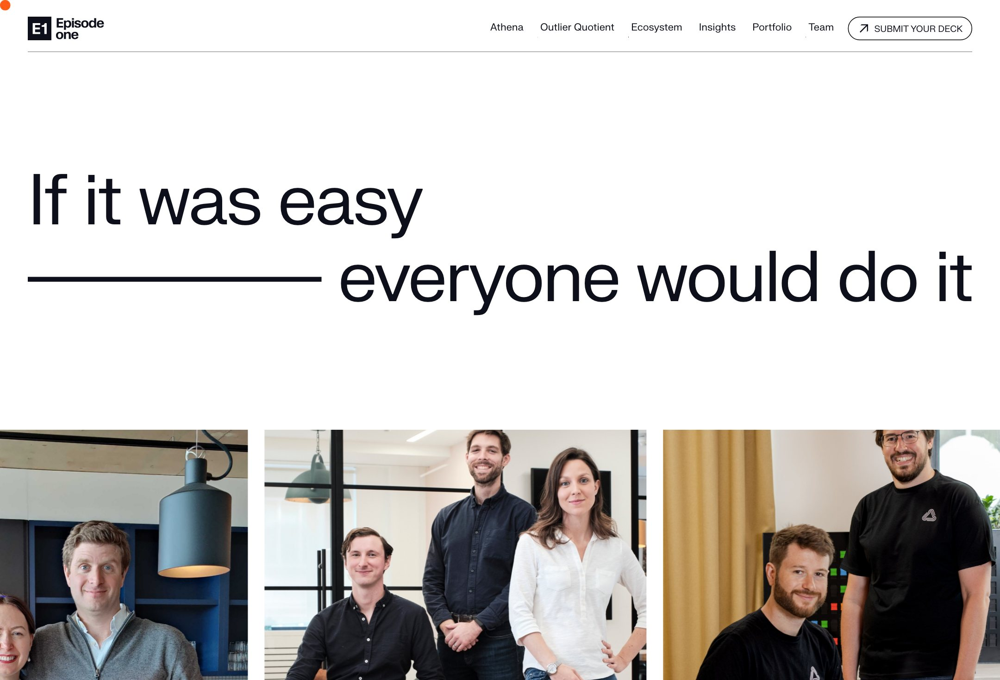

# Venture-Ops

Venture-Ops is an AI fundraising command center for founders: investor discovery, pitch-deck refresh, application drafting, pipeline tracking, and market-aware fundraising ops.

Instead of juggling old decks, scattered investor notes, and generic applications, you get one structured system that helps you:

- find investors and programs that actually fit your company
- refresh your story when the deck, website, and product drift apart
- spot what is missing before a founder call or partner meeting
- prepare cleaner outreach, applications, and follow-ups
- keep a live fundraising memory instead of starting from zero every week

> **Important:** Venture-Ops is not an investor-spam bot. It is a sharpening system. It helps founders choose better targets, tighten the story, and prepare better materials. The founder still decides what gets sent.

## At A Glance



In plain English:

1. You give the system your current deck, website, founder context, and goals.
2. It compares those inputs, finds what is stale or missing, and checks which investors fit.
3. It asks focused follow-up questions where the story is still weak.
4. It gives you refreshed materials, a ranked target list, and a pipeline to work through.

## What This Tool Does

Venture-Ops turns any AI coding CLI into a founder-side fundraising operating system.

It is designed for founders who need to:

- raise a pre-seed, seed, or early institutional round
- apply to accelerators, founder programs, studios, or grants
- keep a pitch deck current without rewriting it from scratch every month
- understand which VCs are a real fit and which are a waste of time
- prepare target-specific application answers and intro blurbs
- maintain a structured memory of traction, proof points, risks, and investor objections

The system is agentic: it can inspect your public startup site, compare it to your current deck, identify what is stale, suggest sharper proof, and prepare target-specific material for the next conversation.

## What You Put In

Even a non-technical founder can think of Venture-Ops as a very organized analyst.

You feed it:

- your current deck
- your website
- founder background
- traction notes
- target round and geography
- a curated investor list or a few URLs to start from

## What You Get Out

You get back:

- a deck refresh audit
- a ranked investor shortlist
- founder follow-up questions
- target-specific outreach/application drafts
- a tracker of who to contact and when
- a market/news memory that helps keep the story current

## Sanitized Real Example

Below is a sanitized example derived from a real founder deck and public company website. Sensitive numbers, customer details, and internal claims are intentionally replaced with placeholders.



What Venture-Ops did with that real case:

- pulled the current deck into structured notes
- checked the front page and public founder profile
- found narrative drift between deck and website
- flagged diligence gaps before investor send
- produced a fresh deck draft and a target shortlist

## Live VC Search Example

This is a visual snapshot from a real live search run on **April 24, 2026** for a European pre-seed AI testing / developer infrastructure company.



Why this matters for a non-technical founder:

- you are not starting from a blank sheet
- the tool narrows the field to a small shortlist with reasons
- it gives you the "why this firm" angle before you write to anyone

## Official Site Snapshots

These are the actual official websites Venture-Ops used in that live search.

<table>
  <tr>
    <td align="center"><br><sub>Crane Venture Partners</sub></td>
    <td align="center"><br><sub>Point Nine</sub></td>
  </tr>
  <tr>
    <td align="center"><br><sub>Seedcamp</sub></td>
    <td align="center"><br><sub>Frontline Seed</sub></td>
  </tr>
  <tr>
    <td align="center"><br><sub>Playfair</sub></td>
    <td align="center"><br><sub>Episode 1</sub></td>
  </tr>
</table>

Live sources:

- [Crane Venture Partners](https://crane.vc/)
- [Point Nine](https://www.pointnine.com/)
- [Seedcamp](https://seedcamp.com/)
- [Frontline Seed](https://frontline.vc/frontline-seed/)
- [Playfair](https://playfair.vc/)
- [Episode 1](https://www.episode1.com/)

## What A Founder Actually Does

If you are non-technical, the workflow is simple:

1. Put your current story into `startup.md`, `founder-bio.md`, and `traction-digest.md`.
2. Add your target round and geography in `config/profile.yml`.
3. Add investor names or URLs in `investors.yml`.
4. Ask the agent to refresh the deck, scan investors, or compare targets.
5. Review the generated shortlist and answer the follow-up questions.
6. Send only the best applications and intros, not everything everywhere.

## Features

| Feature | What it means in practice |
|---------|---------------------------|
| **Target Scanner** | Finds investors, accelerators, angels, and founder programs that match your stage, sector, geography, and round |
| **Fit Evaluation** | Explains why a target fits or does not fit, instead of just giving you a name |
| **Deck Refresh** | Compares deck, website, founder inputs, and current proof to find stale claims and missing slides |
| **Pitch Deck Generation** | Drafts a 10-12 slide narrative and exports it to HTML/PDF |
| **Founder Question Loop** | Asks the highest-value questions when your story is incomplete or inconsistent |
| **News / Trend Memory** | Tracks market shifts, relevant incidents, and category timing hooks in `market-watch.md` |
| **Pipeline Tracking** | Keeps a single source of truth for targets, statuses, and follow-up timing |
| **Human-in-the-Loop** | Drafts and recommends, while the founder stays in control of submissions |

## Example Use Cases

### 1. Refresh a stale deck before investor meetings

You have:

- a PDF deck from a few weeks ago
- a startup website that has evolved
- product updates that are not reflected in the narrative

Use Venture-Ops to:

- compare the deck against the front page
- flag missing metrics, outdated product scope, and stale screenshots
- ask targeted founder questions
- generate an updated 12-slide draft

### 2. Find real-fit investors instead of broad lists

You are a Berlin-based pre-seed founder building developer infrastructure.

Use Venture-Ops to:

- configure your target profile once
- scan a curated investor universe
- rank targets by fit
- identify who deserves time this week and who should be skipped

### 3. Apply to accelerators without generic answers

You want to apply to YC, EF, Antler, or another founder program.

Use Venture-Ops to:

- adapt the company story to each program
- generate sharper founder bios and application answers
- highlight where the deck underexplains the "why now"

### 4. Keep the fundraising narrative current

The market changes fast.

Use Venture-Ops to:

- monitor current trends and adjacent-company news
- update `market-watch.md`
- surface "this should change in the deck now" signals before the next investor call

## Quick Start

```bash
git clone https://github.com/Desperado/venture-ops.git
cd venture-ops
npm install
npx playwright install chromium
npm run doctor
```

Then customize:

1. Edit `startup.md` with the company source of truth.
2. Edit `founder-bio.md` with founder background and credibility.
3. Edit `traction-digest.md` with metrics, customers, and proof.
4. Edit `market-watch.md` with trends, competitor moves, and timing hooks.
5. Edit `config/profile.yml` for stage, geography, round size, and investor targeting.
6. Edit `investors.yml` to add funds, angels, accelerators, grants, or founder programs you want to track.

If you want to refresh the public visuals:

```bash
npm run readme:assets
```

## Usage

### Local commands

```bash
npm run doctor                  # initialize and verify setup
npm run scan -- --dry-run       # preview matching targets
npm run scan                    # append matches to data/pipeline.md
npm run verify                  # validate tracker/report integrity
npm run deck -- deck.html out.pdf
npm run followup                # surface follow-up candidates from tracker
```

### Inside an AI coding agent

```text
/venture-ops                    -> show menu
/venture-ops scan               -> discover matching targets
/venture-ops evaluate {URL}     -> investor/accelerator fit report
/venture-ops deck {target}      -> tailored pitch deck package
/venture-ops refresh            -> audit deck + website + founder updates
/venture-ops news               -> trends/news monitoring and implications
/venture-ops apply {target}     -> application / outreach assistant
/venture-ops pipeline           -> process data/pipeline.md
/venture-ops tracker            -> status overview
/venture-ops followup           -> cadence and draft follow-ups
/venture-ops compare            -> rank multiple targets
/venture-ops deep               -> deep-dive one target
```

Or just paste:

- a VC URL
- an accelerator page
- your current deck
- your startup site

and ask the agent to run the relevant mode.

## Example Prompts

```text
Refresh my deck from this PDF and compare it against my website.

Find the top 10 VCs in Europe for a pre-seed developer-tools company.

Evaluate whether YC or EF is the stronger fit for us right now.

Turn this existing fundraising narrative into a tighter 12-slide deck.

Read my startup front page and tell me what an investor would still find unclear.

Update market-watch.md with the last 30 days of relevant category news.
```

## How It Works

```text
Deck + website + founder memory + traction notes
                   │
                   ▼
        Refresh loop + fit scoring + trend monitoring
                   │
          ┌────────┼────────┐
          ▼        ▼        ▼
      Reports    Decks    Tracker
       .md      .pdf/.html  .md
```

The important point: Venture-Ops is not just "write me a deck." It is a reusable operating model:

- source of truth files
- mode-based workflows
- investor scanner
- refresh loop
- narrative memory
- tracker discipline

## Core Files

| File | Purpose |
|------|---------|
| `startup.md` | Company source of truth: problem, solution, market, traction, roadmap |
| `founder-bio.md` | Founder narrative, credibility, founder-market fit |
| `traction-digest.md` | Compact proof-point memory for investor materials |
| `market-watch.md` | Current trends, news hooks, competitor signals |
| `config/profile.yml` | Raise profile, round, geography, sectors, ideal target types |
| `investors.yml` | Curated target universe for scanning and fit matching |
| `data/pipeline.md` | Pending targets to process |
| `data/targets.md` | Fundraising tracker |
| `reports/*` | Generated evaluations, deck drafts, and refresh audits |
| `output/*` | Generated slide HTML and PDFs |

## Project Structure

```text
venture-ops/
├── startup.md
├── founder-bio.md
├── traction-digest.md
├── market-watch.md
├── config/profile.yml
├── investors.yml
├── modes/
├── templates/
├── data/
├── reports/
├── output/
└── assets/readme/
```

## Operating Principle

This is a filter, not a spam machine.

A small number of high-fit, high-context investor conversations beats broad cold outreach. Venture-Ops should make the founder sharper, not noisier.

It should also get better over time:

- every founder correction sharpens the profile
- every new metric improves the deck
- every missed question becomes a future checklist item
- every market change updates the narrative memory

## Disclaimer

**Venture-Ops is a local, open-source workflow, not a hosted fundraising platform.**

By using it, you acknowledge:

1. **You control your data.** Founder details, investor notes, traction, and fundraising materials stay on your machine unless you choose to send them to an AI provider.
2. **You control submissions.** The system drafts and recommends, but it should not submit applications or send outreach on your behalf.
3. **You verify current facts.** Investor partners, deadlines, check sizes, and program terms change frequently; current claims should be checked before use.
4. **No guarantees.** Fit scores are recommendations, not truth. Investors are not deterministic systems. Use judgment.

## License

MIT
